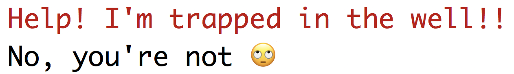

# Notes

<div id="messages"></div>

***writing output***

To write messages, `cat()` or `message()` can be used. Their differences:

 * `cat()` goes to standard out and `message()` goes to standard error. When used inside of _some_ parallel processing backends, `cat()` output is obscured inside of the RStudio IDE. 
 
 * Unless coded otherwise, `cat()` uses the usual formatting whereas the default formatting for `message()` is different. 
 
For this code:
 
```{r emoji, eval = FALSE}
library(emojifont)
message("Help! I'm trapped in the well!!")
cat("No, you're not", emoji('roll_eyes'), "\n")
```

the Rstudio IDE output is: 

```{r ide-code, echo = FALSE, fig.align='center', out.width = '50%'}

```

and basic terminal output is:

```{r console-code, echo = FALSE, fig.align='center', out.width = '50%'}
knitr::include_graphics("console_formatting.png")
```

[This post](https://www.jstorimer.com/blogs/workingwithcode/7766119-when-to-use-stderr-instead-of-stdout) may also be helpful in deciding. 

[`r emojifont::emoji('leftwards_arrow_with_hook')`](#messages-back)


<div id="decouple"></div>

***decoupling functions***

For example, for some modeling method, the function `foo` would be the top-level api that users experience and some other function (say `compute_foo_fit`) is used to do the computations. This allows for different interfaces to be used to specify the model that pass common data structures to `compute_foo_fit`. 

[`r emojifont::emoji('leftwards_arrow_with_hook')`](#decouple-back)

<div id="user-appropriate"></div>

***appropriate data structures***

For example:  

 * Categorical data should be in factor variables (as opposed to binary or integer representations). 
 * Rectangular data structures that allows for mixed data types should _always_ be used even when the envisioned application would only make sense when the data are single type. 
 * For strictly univariate response models, vector input is acceptable for the outcome argument. 
 * Censored data should follow the `survival::Surv` convention. 

[`r emojifont::emoji('leftwards_arrow_with_hook')`](#user-appropriate-back)

<div id="top-level"></div>

***top-level design examples***

For example: 

 * Suppose a model can only fit numeric or two-class outcomes and uses maximum likelihood. Instead of providing the user with a `distribution` option that is either "Gaussian" or "Binomial", determine this from the type of the data object (numeric or factor) and set internally. This prevents the user from making a mistake that could haven been avoided. 

 * If a model parameter is bounded by some aspect of the data, such as the number of rows or columns, coerce bad values to this range (e.g. `mtry = min(mtry, ncol(x))`) with an accompanying warning when this is critical information. 

[`r emojifont::emoji('leftwards_arrow_with_hook')`](#top-level-back)

<div id="common-param"></div>

***avoid common parameter names***

For example, `control` is the type of argument used in many functions so have a function specific argument (e.g. `foo_control`) is advisable in these situations. 

[`r emojifont::emoji('leftwards_arrow_with_hook')`](#common-param-back)

<div id="standardized"></div>

***standardize names***

For example, many functions use some variation of `level` for confidence levels (as opposed to `alpha`). The names in Chapter \@ref(standardized-argument-names) are preferable for the specific context.   

[`r emojifont::emoji('leftwards_arrow_with_hook')`](#standardized-back)


<div id="discuss"></div>

***discussing new names***

A good venue for this discussion is [RStudio Community](https://community.rstudio.com/)

[`r emojifont::emoji('leftwards_arrow_with_hook')`](#discuss-back)


<div id="calls"></div>

***avoid computing on `call` objects***
	
Historically, the call object that results from a model fit was considered a good method to capture details of the existing model fit. This object could be parsed and manipulated for the purpose of continuing or revising the model _between function calls_.

This can be problematic because the call object is relative to the environment and the call itself is agnostic to its original environment. If the call is changed and re-evaluated, the current environment may be inappropriate. This could result in errors due to the required objects not being exposed in the current environment.  

Note that the internals of common modeling functions, such as `lm`, do exactly this. However, these manipulations occur _within_ the function call to that the environment is the same.  

[`r emojifont::emoji('leftwards_arrow_with_hook')`](#calls-back)

<div id="dplyr-like"></div>

***extra tibble classes***

Adding a new class to a tibble object might cause subsequent errors to `dplyr` operations. [This code](https://github.com/tidyverse/googledrive/blob/master/R/dplyr-compat.R) is a good example for how to maintain `dplyr` compatibility. 

[`r emojifont::emoji('leftwards_arrow_with_hook')`](#dplyr-like-back)

<div id="list-cols"></div>

***list column output***
   
Some examples:  

**posterior distirbutions**   

   
If a posterior distribution is returned for each sample, each element of the list column can be a tibble with as many rows as samples in the distribution. 

**multiple hyperparameters** 
    
When a `predict` method produces values over multiple tuning parameter values (e.g. `glmnet`), the list column elements have rows for every tuning parameter value combination that is being changed (e.g. `lambda` in `glmnet`). 

**survivor probability predictions** 
    
In time to event models, where survivor probabilities are produced for values of `time`, the return tibble has a column for `.time`. Other column names should conform to the standards here (e.g. `.pred_lower` if intervals are also returned). As an example from `?flexsurv::flexsurvreg`:
   
```{r flexsurv-model, include} 
library(flexsurv)
data(ovarian)
fitg <- flexsurvreg(formula = Surv(futime, fustat) ~ age, data = ovarian, dist = "gengamma")
```

For each new sample, this model can make probabilistic predictions at a number of user-specified time points. 
```{r flexsurv-pred}
preds <- summary(fitg, newdata = ovarian[1:2, "age", drop = FALSE], t = c(100, 200, 300))
preds
```

A list of data frames is not very helpful. Better would be a data frame with a list column, were every element is a data frame with the predictions in the tidy format:

```{r flexsurv-tidy-calc, include = FALSE}
preds <- lapply(preds, setNames, c(".time", ".pred", ".pred_lower", ".pred_upper"))
preds <- lapply(preds, as_tibble)
library(tibble)
tidy_preds <- tibble(.pred = preds)
```
```{r flexsurv-tidy}
tidy_preds

# predictions on the first subject at 3 time points
tidy_preds$.pred[[1]]
```

If a single data frame is needed, it is easy to make the conversion:

```{r flexsurv-unnest}
tidyr::unnest(tidy_preds)
```

**percentile predictions** 

When using a quantile regression, one might make the median the default that is predicted. If multiple percentiles are requested, then `.pred` would be a tibble with a column for the predictions and another for the percentile.  

[`r emojifont::emoji('leftwards_arrow_with_hook')`](#list-cols-back)